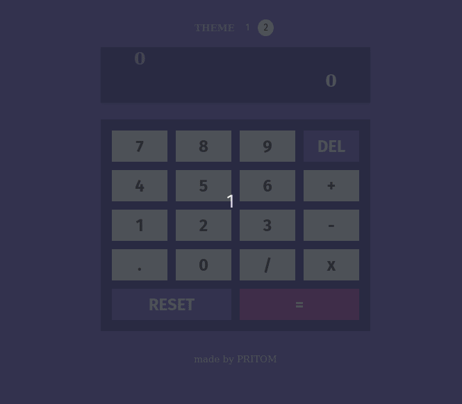
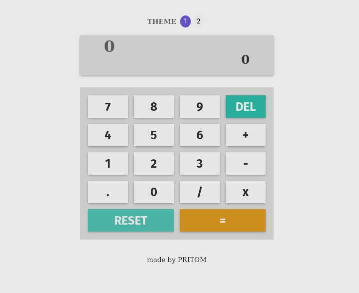
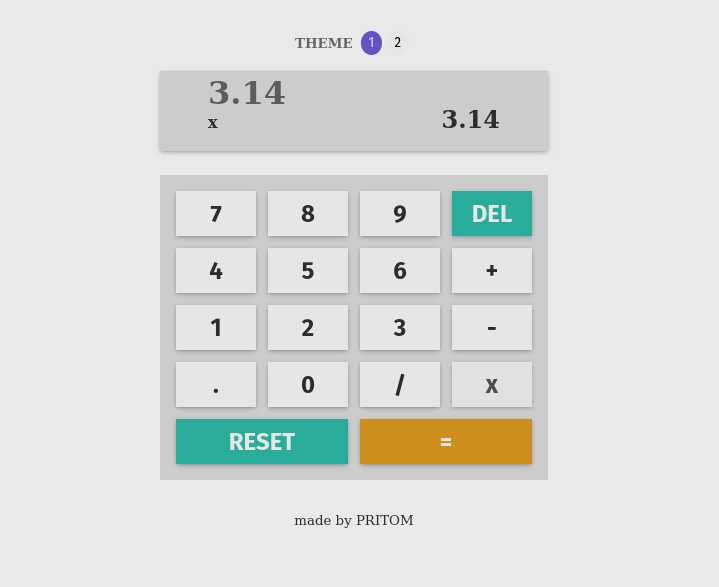
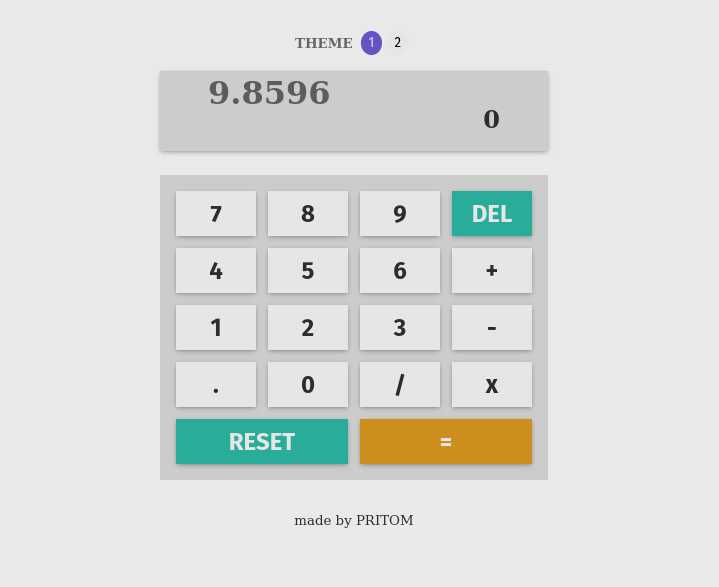
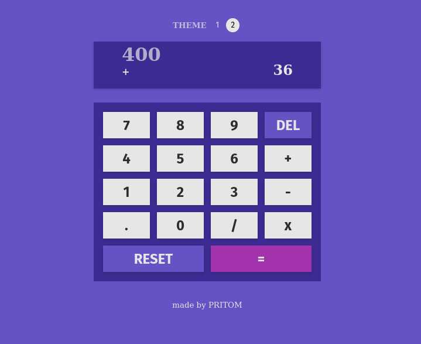

# Calculator

The simple calculator app is a web-based tool that allows users to perform basic arithmetic operations, including addition, subtraction, multiplication, and division. It features a clear button that enables the user to erase input and a toggle theme button to switch between different color schemes. The app supports decimal values, making it possible to perform calculations with high precision.

## Features:

1. Basic Arithmetic Operations: The calculator is able to perform basic arithmetic operations such as addition, subtraction, multiplication, and division. This means that the user is able to input two values and the calculator is able to compute their sum, difference, product, or quotient.

2. Clear Functionality: A "Clear" button is included to allow the user to clear the input field or the entire calculator display. This feature is important to allow the user to start a new calculation or to correct a mistake in their input.

3. Decimal Support: The calculator supports decimal values to enable users to perform calculations with more precision. This means that the user is able to input decimal values and the calculator is able to handle them correctly in its calculations. The calculator display is also able to show decimal values.

4. Toggle Theme: A "Toggle Theme" button is included to allow the user to switch between different color schemes or themes for the calculator. This feature helps to enhance the user experience and allow users to choose a theme that suits their personal preferences. The different themes includes light and dark modes, the user can choose from. When the user toggles the theme, the calculator changes the background color, text color, and other visual elements of the interface to match the selected theme.

---

## App Preview:

 

 

---

## Preview images:

 

### Light Theme:

 

 

- This will be the default theme of the app.
- Input number and do simple arithmatic operations with numbers.

 

### Decimal Support:

 

 

- The app supports decimal numbers and calculation.
- The result is displayed to three decimal point.

 

### Clear Functionality:

 

 

- Input number without operator will erase previous calculations.
- `DEL` button allows to erase input value one digit at a time.

 

### Multiple-Themes:

 

 

- The code is written using dynamic `CSS`. Making it extremely easy to add new additional themes and accent colors.
- Current version has two themes. Can be toggled from the button above.

 
 

---

## Tech Stack Used:

 

  
  

  

---

## Link of deployed app:

TBA

---

## Profiles:
